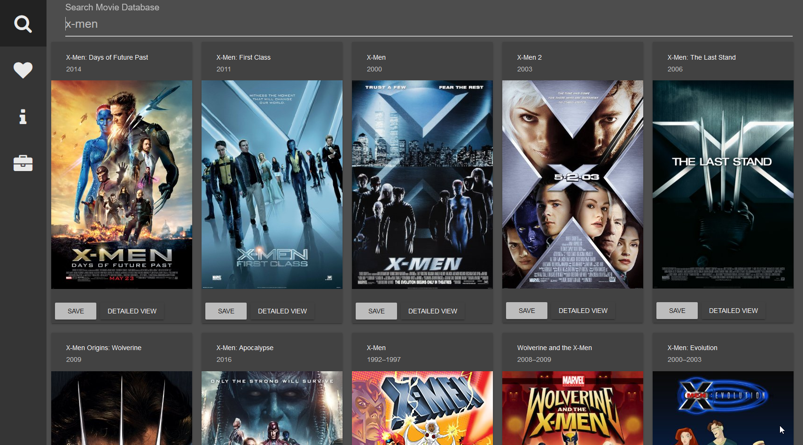
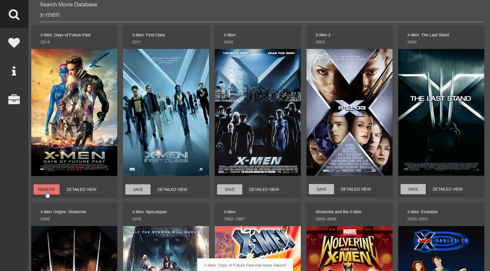
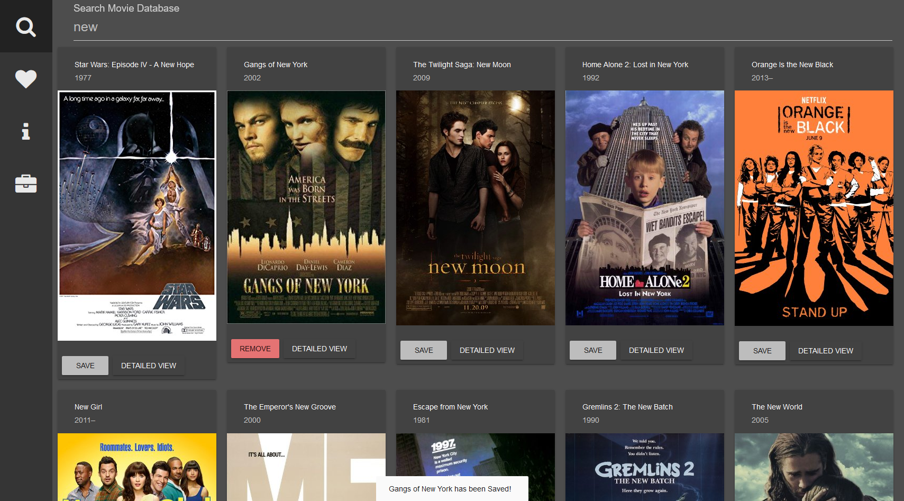
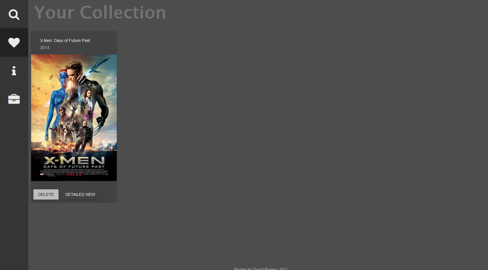
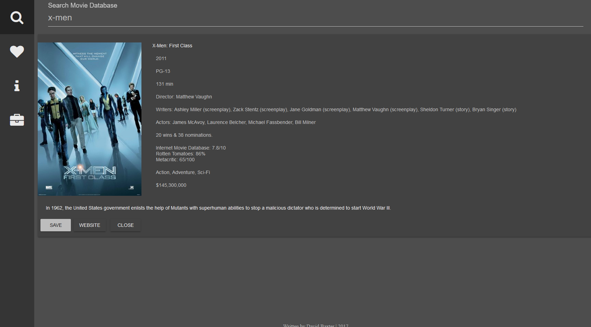

# IMDB Demo App

This Imdb Demo app is a showcase of some of my knowledge of Angular 4, Javascript/TS, SASS, and various frameworks and tools. 

## What tools are used

* [Angular](https://angular.io/)
* [Material UI](https://www.npmjs.com/package/material-ui)
* [Angular Cli](https://github.com/angular/angular-cli)
* [IMDB API](https://www.npmjs.com/package/imdb-api)

## Development server

Run `ng serve` for a dev server. Navigate to `http://localhost:4200/`. The app will automatically reload if you change any of the source files.

## Running unit tests

Run `ng test` to execute the unit tests via [Karma](https://karma-runner.github.io).

## Running end-to-end tests

Run `ng e2e` to execute the end-to-end tests via [Protractor](http://www.protractortest.org/).
